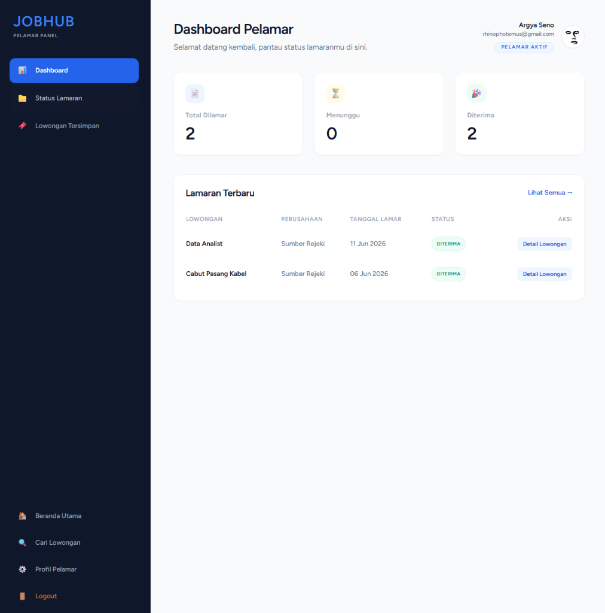
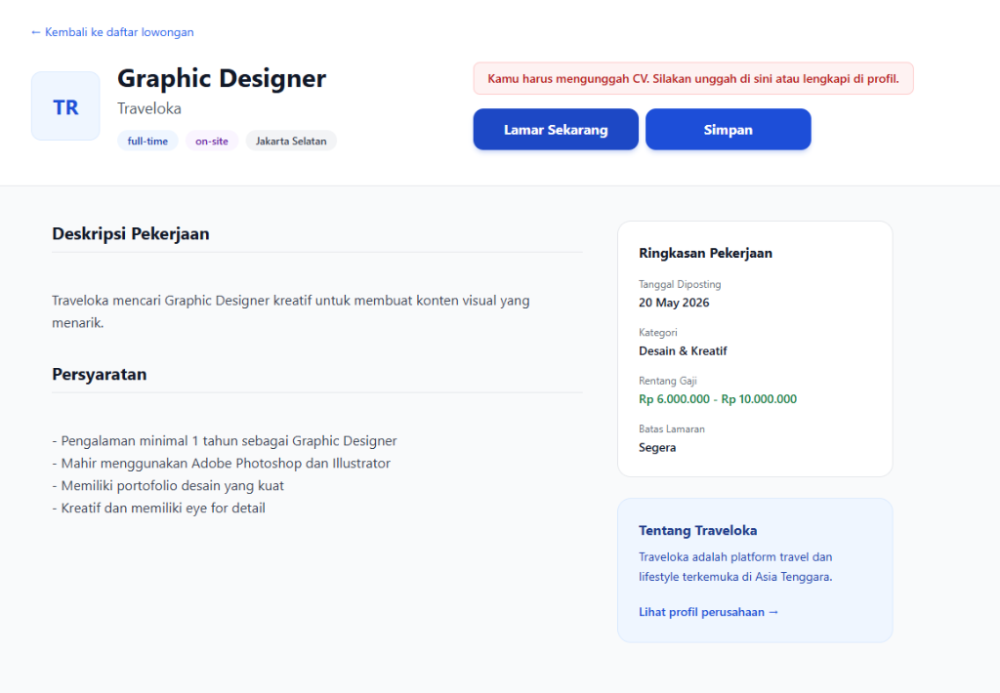
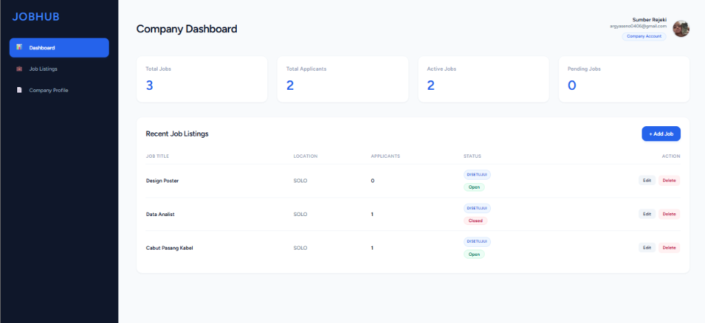
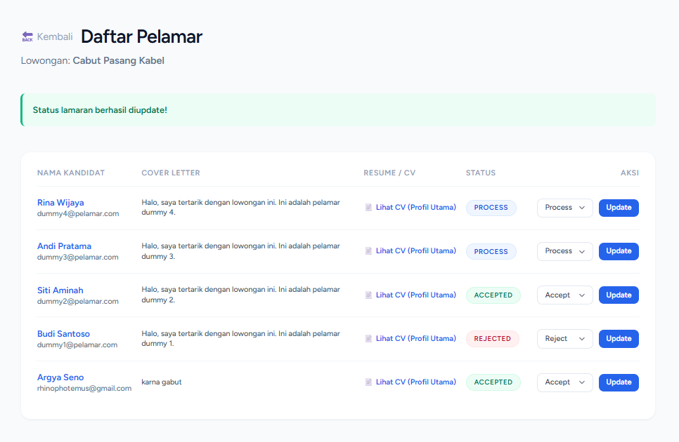
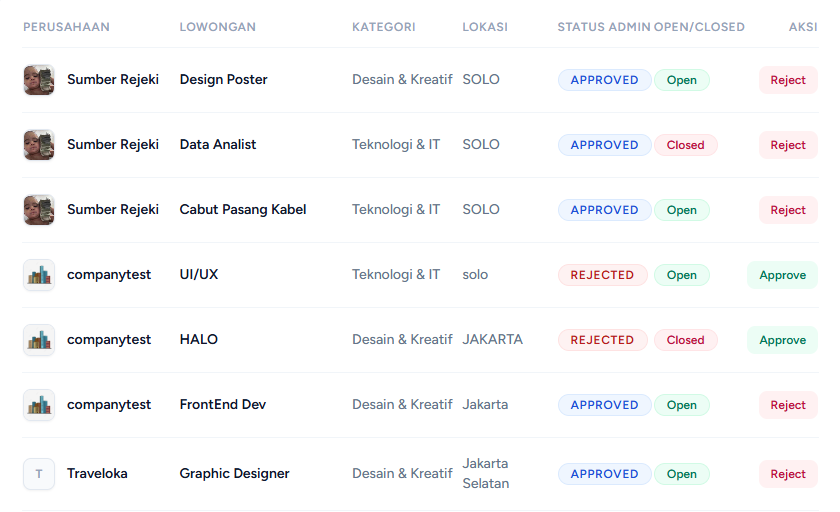
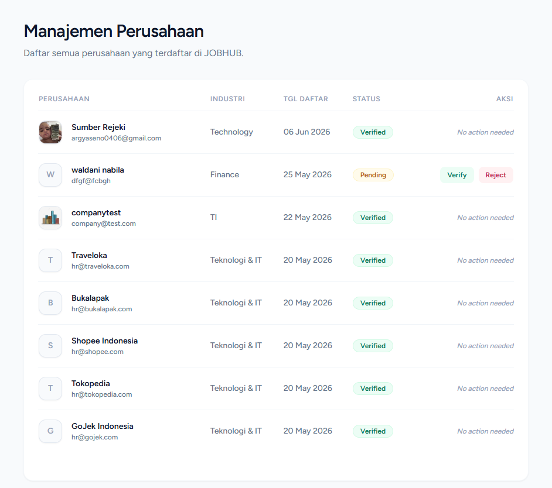

# JOBHUB — Platform Rekrutmen Online

Proyek Praktikum Rekayasa Perangkat Lunak (RPL) — Kelompok A-1

**JOBHUB** adalah platform rekrutmen online berbasis web yang menghubungkan pencari kerja dengan perusahaan secara langsung. Platform ini menyediakan alur rekrutmen end-to-end mulai dari posting lowongan, pencarian kerja, pengiriman lamaran, hingga pengelolaan status penerimaan. Dibangun menggunakan Laravel 12 dengan arsitektur multi-role (Pencari Kerja, Perusahaan, dan Administrator).

---

## Daftar Fitur Utama

### Autentikasi dan Otorisasi
- Registrasi akun dengan pilihan role (Pencari Kerja / Perusahaan) dan verifikasi instan
- Login, logout, lupa password, dan reset password
- Role-based access control untuk tiga role utama

### Halaman Publik
- Landing page dengan daftar lowongan terbaru dan statistik platform
- Pencarian dan filter lowongan berdasarkan kategori, lokasi, dan kata kunci
- Detail lowongan pekerjaan lengkap dengan informasi perusahaan
- Profil publik perusahaan beserta daftar lowongan aktif
- Halaman Tentang Kami

### Dashboard Pencari Kerja
- Kelola profil pribadi (foto, bio, dan CV/Resume)
- Kirim lamaran pekerjaan pada lowongan yang aktif
- Batalkan lamaran yang sudah dikirim
- Simpan lowongan ke dalam Bookmark
- Pantau status lamaran secara real-time (Pending, Diterima, Ditolak)

### Dashboard Perusahaan
- Kelola profil perusahaan (logo, deskripsi, dan informasi kontak)
- Buat, edit, dan hapus lowongan pekerjaan
- Lihat daftar pelamar untuk setiap lowongan
- Lihat detail profil dan CV pelamar
- Ubah status lamaran pelamar (Terima / Tolak)

### Dashboard Administrator
- Statistik dan monitoring platform secara keseluruhan
- Verifikasi atau tolak pendaftaran perusahaan baru
- Approve atau reject lowongan pekerjaan yang diajukan perusahaan
- Kelola kategori pekerjaan (tambah / hapus)
- Kelola akun pengguna (aktifkan / nonaktifkan / hapus)

---

## Screenshot Aplikasi

### Dashboard Pencari Kerja


### Detail Lowongan Pekerjaan


### Dashboard Perusahaan


### Manajemen Pelamar (Perusahaan)


### Manajemen Lowongan (Admin)


### Manajemen Perusahaan (Admin)


---

## Prasyarat

Pastikan perangkat berikut sudah terpasang sebelum menjalankan proyek:

| Komponen     | Versi Minimum  |
|--------------|----------------|
| PHP          | 8.2            |
| Composer     | 2.x            |
| Node.js      | 18.x           |
| npm          | 9.x            |
| MySQL        | 8.x            |

Atau cukup pasang **Docker** dan **Docker Compose** jika ingin menjalankan via container.

### Framework dan Library Utama

| Nama              | Keterangan                          |
|-------------------|-------------------------------------|
| Laravel 12        | Framework backend (PHP)             |
| Laravel Breeze    | Starter kit autentikasi             |
| Tailwind CSS      | Utility-first CSS framework         |
| Alpine.js         | Lightweight JavaScript framework    |
| Vite              | Frontend build tool dan dev server  |

---

## Cara Instalasi (Step-by-Step)

### Opsi 1 — Docker (Direkomendasikan)

1. Clone repositori:
   ```bash
   git clone https://github.com/WaldaniNabila/praktikum-rpl-a-1.git
   cd praktikum-rpl-a-1/src
   ```

2. Jalankan container:
   ```bash
   docker compose up --build
   ```

3. Jalankan migrasi database (di terminal terpisah):
   ```bash
   docker compose exec app php artisan migrate
   ```

4. Akses aplikasi di browser:
   ```
   http://localhost:8000
   ```

### Opsi 2 — Instalasi Lokal

1. Clone repositori:
   ```bash
   git clone https://github.com/WaldaniNabila/praktikum-rpl-a-1.git
   cd praktikum-rpl-a-1/src
   ```

2. Install dependensi PHP:
   ```bash
   composer install
   ```

3. Salin file environment dan generate application key:
   ```bash
   cp .env.example .env
   php artisan key:generate
   ```

4. Konfigurasi database pada file `.env`:
   ```
   DB_CONNECTION=mysql
   DB_HOST=127.0.0.1
   DB_PORT=3306
   DB_DATABASE=jobhub
   DB_USERNAME=root
   DB_PASSWORD=
   ```

5. Jalankan migrasi database:
   ```bash
   php artisan migrate
   ```

6. Install dependensi Node.js dan kompilasi aset:
   ```bash
   npm install
   npm run build
   ```

7. Jalankan development server:
   ```bash
   php artisan serve
   ```

8. Akses aplikasi di browser:
   ```
   http://localhost:8000
   ```

---

## Cara Menjalankan Aplikasi

Setelah instalasi selesai, gunakan salah satu perintah berikut untuk menjalankan aplikasi:

**Docker:**
```bash
cd src
docker compose up
```

**Lokal (development mode):**
```bash
cd src
php artisan serve
# Pada terminal terpisah:
npm run dev
```

Aplikasi akan berjalan di `http://localhost:8000`.

---

## Struktur Folder Proyek

```
praktikum-rpl-a-1/
├── docs/                          # Dokumentasi proyek
│   ├── screenshots/               # Screenshot hasil pengujian
│   ├── uml/                       # Diagram UML
│   │   ├── usecase_diagram.png
│   │   ├── class_diagram.png
│   │   └── acitivity_diagram.png
│   ├── wireframes/                # Wireframe desain UI
│   ├── Problem-statemen.md        # Rumusan masalah
│   ├── User-stories.md            # User stories per role
│   ├── Backlog.md                 # Product backlog
│   ├── srs.md                     # Software Requirements Specification
│   ├── erd.png                    # Entity Relationship Diagram
│   ├── data_dictionary.md         # Kamus data
│   ├── test-cases.md              # Skenario pengujian
│   ├── user-manual.md             # Panduan penggunaan
│   └── team-contract.md           # Kontrak kerja tim
│
├── src/                           # Source code aplikasi Laravel
│   ├── app/
│   │   ├── Http/Controllers/      # Controller (Landing, Job, Company, Admin)
│   │   ├── Models/                # Eloquent models
│   │   └── ...
│   ├── config/                    # Konfigurasi aplikasi
│   ├── database/
│   │   ├── migrations/            # File migrasi database
│   │   └── seeders/               # Seeder data
│   ├── resources/
│   │   ├── views/                 # Blade templates
│   │   ├── css/                   # Stylesheet
│   │   └── js/                    # JavaScript
│   ├── routes/
│   │   └── web.php                # Definisi route
│   ├── tests/                     # Unit dan feature test
│   ├── docker-compose.yml         # Konfigurasi Docker
│   ├── Dockerfile
│   └── ...
│
├── tests/                         # Dokumentasi testing
└── README.md                      # File ini
```

---

## Anggota Tim

| Nama               | NIM       |
|--------------------|-----------|
| Argya Seno         | L0124004  |
| Intan Trinanda     | L0124018  |
| Izanahda Nurkhasna | L0124019  |
| Waldani Nabila     | L0124122  |

---

## Dokumentasi Lengkap

Seluruh dokumentasi proyek tersedia di folder [`docs/`](./docs/):

| Dokumen                                              | Keterangan                              |
|------------------------------------------------------|-----------------------------------------|
| [Problem Statement](./docs/Problem-statemen.md)      | Rumusan masalah yang ingin diselesaikan |
| [User Stories](./docs/User-stories.md)               | Daftar user stories per role            |
| [Product Backlog](./docs/Backlog.md)                 | Backlog item dan prioritas              |
| [SRS](./docs/srs.md)                                 | Software Requirements Specification     |
| [ERD](./docs/erd.png)                                | Entity Relationship Diagram             |
| [Data Dictionary](./docs/data_dictionary.md)         | Kamus data untuk setiap entitas         |
| [Test Cases](./docs/test-cases.md)                   | Skenario pengujian aplikasi             |
| [User Manual](./docs/user-manual.md)                 | Panduan penggunaan aplikasi             |
| [Team Contract](./docs/team-contract.md)             | Kontrak kerja tim                       |
| [Changelog](./CHANGELOG.md)                          | Riwayat perubahan versi aplikasi        |
| [AI-Usage Log](./AI-USAGE-LOG.md)                    | Log penggunaan AI selama pengembangan   |

---

## Lisensi

Proyek ini menggunakan lisensi [MIT](https://opensource.org/licenses/MIT).
